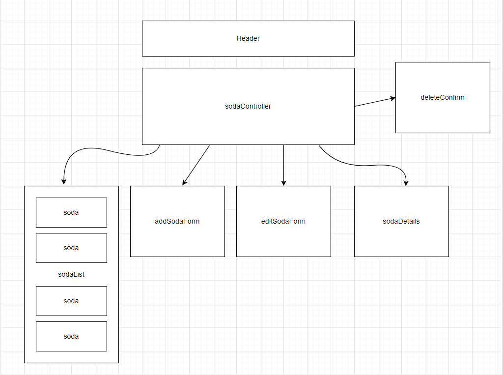

# _Suzy's Soda Shop_        

#### By **Christina Welch** 

#### _A webpage made with react to track soda in soda fountains_

 

##### Photo By **Spencer Davis on Unsplash.com**

 
## 💾 Technologies Used

* [HTML](https://developer.mozilla.org/en-US/docs/Web/HTML)
* [CSS](https://developer.mozilla.org/en-US/docs/Web/CSS)
* [JavaScript](https://developer.mozilla.org/en-US/docs/Web/JavaScript)
* [React](https://reactjs.org/)
* [JSX](https://www.typescriptlang.org/docs/handbook/jsx.html)
* [UUID](https://www.npmjs.com/package/uuid)

 

## 💻 Description

_End of week friday project for epicodus school made to demonstrate skills in React applications. It has full CRUD(create, read, update, delete) functionality, using react components, props, and functional programming concepts._

 

## ⚙️ Setup

* Clone the GitHub repository: https://github.com/christophermneal/merch-site
* From the main project directory, run npm install in the terminal to load necessary plugins and packages.
* Run npm install --save-exact react-scripts@3.2.0 to install React version 3.2.0
* Run npm run start to start the application.

## Components Diagram

 

## ❌ Known Bugs

no known bugs

## 📃 License

MIT License

Copyright (c) [2022] [Christina Welch]